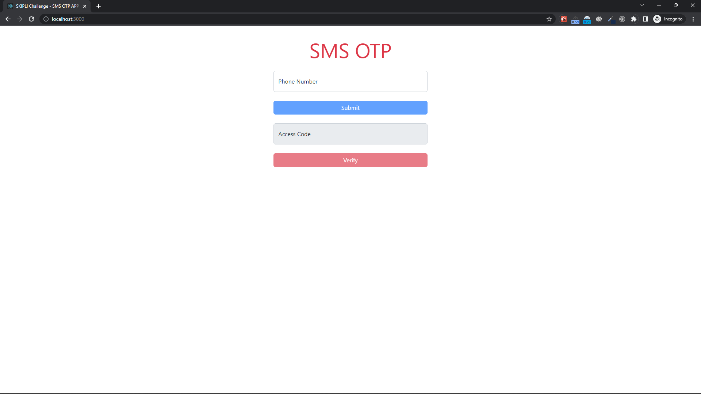

# TrangPN - Jackie Trang

skipli-challenge

## Available Scripts

In the project directory, you can run:

### 1. To start backend service
cd backend-skipli-challenge-trangpn90

#### config environment
open .env
##### twilio config
ACCOUNT_SID=your-account-sid-twilio
AUTH_TOKEN=your-auth-token-twilio

##### firebase config
API_KEY=your-API_KEY-firebase
AUTH_DOMAIN=your-AUTH_DOMAIN-firebase
PROJECT_ID=your-PROJECT_ID-firebase
STORAGE_BUCKET=your-STORAGE_BUCKET-firebase
MESSAGING_SENDER_ID=your-MESSAGING_SENDER_ID-firebase
APP_ID=your-APP_ID-firebase

cd controllers
- open userController.js
-> from: your-phone-number-of-twilio

#### `npm start`

Runs the app in the development mode.\
Open [http://localhost:3600](http://localhost:3600) to view it in the browser.

The page will reload if you make edits.\
You will also see any lint errors in the console.

### Structure project's
- controllers -> Defined controller handle logic
- models -> Defined model data
- routers -> Defined endpoint service

### 2. To start web app
cd frontend-skipli-challenge-trangpn90
#### `npm start`

Runs the app in the development mode.\
Open [http://localhost:3000](http://localhost:3000) to view it in the browser.

The page will reload if you make edits.\
You will also see any lint errors in the console.

### Structure project's
- assets -> Include scss and media
- components -> Defined base component
- contexts -> Defined global state by using Context API
- hooks -> custom hook
- layouts -> Defined component to setup view for end user can see
- utils -> Defined the interface need use in app
